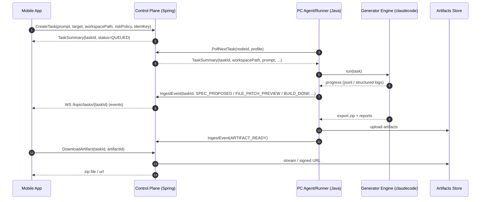

# AutoCode × ClaudeCode 企业级架构设计（B→A 路线）

> 目标：在现有 **AutoCode Control Plane（Spring Boot）+ PC Agent（Java）+ shared-protocol** 的 MVP 之上，引入 **ClaudeCode（claudecode）** 作为“生成引擎（Generator Engine）”，面向企业交付一个可审计、可控、可扩展的“移动端自然语言生成 Web/小程序工程”的平台。  
> 路线：**先 B（导出工程/离线交付）**，再 **A（云端托管/在线预览与部署）**。两阶段复用同一任务/事件/审批/审计协议，仅替换执行 Runner 与产物分发方式。

---

## 1. 范围与非目标

### 1.1 本文覆盖
- **端到端链路**：移动端 → Control Plane → Agent/Runner → 生成引擎（claudecode）→ 产物（zip / repo / artifacts）
- **企业级能力**：身份与授权、最小权限执行、审批强绑定、审计不可篡改、可观测性、可扩展性、交付与运维
- **B→A 演进**：接口与数据模型如何保持稳定

### 1.2 非目标（当前不做或后置）
- 全量多云部署细节（K8s Helm/Operator 级别）
- 完整的 IDE 插件矩阵
- 复杂的可视化低代码编辑器（可作为后续产品方向）

---

## 2. 现状基线（MVP 已具备能力）

当前 `AutoCode` MVP 已具备（以仓库说明为准）：
- 任务闭环：创建 → 分发 → Agent 执行（模拟）→ 事件回传 → 审批 → 完成/失败
- 事件系统：事件落库 + `seq` 增量补流（WebSocket 广播）
- 可靠性语义：DB 原子 claim + lease/过期回收 + requeue
- 安全雏形：高风险审批流；token 模式（后续升级 JWT/mTLS/RBAC）
- 基础设施：MySQL（JPA + Flyway），Redis 队列（可回退 inmem），STOMP WebSocket

---

## 3. 目标架构总览（企业级形态）

### 3.1 逻辑组件
- **Mobile App（iOS/Android）**
  - 语音/文本输入 → 任务创建
  - 订阅任务事件流 → 进度/日志/预览/下载
  - 审批高风险动作（例如执行命令、联网、发布）
- **Control Plane（Spring Boot）**
  - 任务 API（创建/查询/取消/审批/产物）
  - 调度（profile/lane/lease）与幂等
  - 事件摄取/校验/落库/广播
  - 审计（不可篡改）与策略决策
- **Agent / Runner（Java）**
  - 轮询领取任务、执行任务、上报结构化事件
  - 执行面策略引擎（workspace allowlist、工具/命令白名单、禁网等）
  - 负责运行 **ClaudeCode Generator Engine（claudecode）**
- **Generator Engine（claudecode 二开/包装）**
  - 把自然语言变为：spec → 脚手架 → 代码变更 → 构建/校验 → 产物导出
  - 通过 Tools 权限系统实现“最小能力集合”
- **Artifacts Store（B 阶段可本地文件/MinIO，A 阶段对象存储+CDN）**
  - 产物（zip / build report / spec / patch）持久化与分发

### 3.2 高层数据流（B：导出工程）

---

## 4. 分层与依赖方向（最佳实践）

### 4.1 Control Plane 分层（建议与现有规划对齐）
- **Domain（领域层）**
  - 任务状态机、审批强绑定规则、事件折叠规则、幂等规则、策略决策接口
  - 不依赖 Spring/JPA/Redis/WS
- **Application（用例编排层）**
  - CreateTask / PollTask / IngestEvent / Approve / Cancel / ListArtifacts / DownloadArtifact
- **Ports（端口）**
  - TaskRepositoryPort、EventStorePort、QueuePort、AuditPort、PolicyPort、ArtifactsPort、AuthPort
- **Adapters（适配器）**
  - JPA、Redis/Rabbit、WebSocket、HTTP、ObjectStorage、OTel、KMS

依赖方向：`domain -> ports <- adapters`，`application` 依赖 `domain + ports`。

### 4.2 Agent/Runner 分层（建议）
- **runtime/**：主循环、重试/退避、任务生命周期
- **policy/**：最小权限策略引擎（allowlist/denylist/审批触发）
- **runner/**：具体执行器（claudecode-runner、mock-runner、future: cloud-runner）
- **client/**：Control Plane API client（mTLS/JWT）
- **tool/**：可插拔工具（本地执行、打包、上传、依赖缓存）

---

## 5. 协议设计（shared-protocol：稳定契约）

### 5.1 Task 输入（CreateTaskRequest 推荐字段）
企业级建议明确以下字段（保持向后兼容）：
- **identity**
  - `projectId`：项目/租户隔离关键字段（必须）
  - `idempotencyKey`：幂等（强烈建议移动端/网关生成）
- **intent**
  - `prompt`：自然语言需求（必须）
  - `target`：`web | miniapp`
  - `templateId`：模板选择（例如 `web.vite.react` / `mini.wx.native`）
  - `exportMode`：`zip | git`（B 阶段优先 zip）
- **execution**
  - `workspacePath`：执行目录（B 阶段常用；A 阶段可为沙箱 workspaceId）
  - `agentProfile`：`coder | miniapp | web` 等（路由）
  - `sessionKey`：lane 串行（同项目同应用迭代建议设置）
- **risk**
  - `riskPolicy`：`low | medium | high`（决定审批/禁网/命令限制）

### 5.2 Event 事件模型（建议最小集合）
保持你们现有 `seq` 增量补流机制，建议补齐一组“生成应用”事件类型（示例）：
- `TASK_CREATED / TASK_STARTED / TASK_DONE / TASK_FAILED`
- `SPEC_PROPOSED`：输出 `spec.json`（结构化需求）
- `APPROVAL_REQUIRED / APPROVAL_RESULT`
- `GEN_SCAFFOLD_DONE`
- `FILE_PATCH_PREVIEW`：变更预览（可含 patch 或 file list）
- `BUILD_STARTED / BUILD_LOG / BUILD_DONE`
- `ARTIFACT_READY`：产物可下载（artifactId、hash、size、mime）

> 约束：事件 payload 必须可验证（schema + 必填字段），并对 `eventVersion` 做版本化。

### 5.3 审批强绑定（Approval Context）
你们已经在控制面实现了对 `command.exec` 的 `action/command/cwd` 强绑定校验。企业级建议扩展到：
- `action`: `app.generate | app.iterate | app.publish`
- `cwd/workspaceRef`: workspacePath 或 workspaceId
- `tool`: `claudecode.run` / `build.run` / `publish.run`
- `inputsHash`: 规范化输入（spec + selected template + locked deps）hash，用于防漂移

---

## 6. 执行面安全（企业级核心）

### 6.1 默认安全姿态（B 阶段）
- **默认禁网**：Runner 只允许访问本地缓存与白名单依赖源（可选内网镜像）
- **workspace allowlist**：只允许在指定根目录下执行（防越权读写）
- **工具最小集**：文件读写/编辑、模板渲染、构建、打包、上传；禁止任意 shell（或仅允许受控命令集）
- **审批门禁**：高风险动作必须审批（例如：开启联网、执行非白名单命令、写入敏感路径、发布）

### 6.2 供应链与依赖控制
- 模板依赖锁定：模板仓库/版本固定（templateId → digest）
- 包管理镜像：企业内网 registry（npm/maven）与允许列表
- 产物签名：zip/artifacts 生成 hash + 可选签名，写入审计链

---

## 7. 可观测性与审计（SRE/合规）

### 7.1 统一标识
- `taskId`：业务主键
- `runId`：一次执行尝试（重试/恢复用）
- `traceId`：分布式追踪（OTel）

### 7.2 指标（示例）
- 控制面：任务创建速率、poll 延迟、claim 冲突率、事件摄取延迟、审批等待时间、失败率
- 执行面：生成耗时分布、构建成功率、zip 产物大小、重试次数、策略拒绝次数

### 7.3 审计不可篡改（建议形态）
最小落地：**hash chain**（prev_hash → hash），关键事件（审批/发布/下载）必须入审计。
进阶：签名链 + 归档到 WORM（对象存储合规桶）+ 可验证导出包。

---

## 8. 产物（Artifacts）体系（B 的关键交付）

### 8.1 产物规范（建议）
每个任务至少产出：
- `spec.json`：结构化需求 v1
- `build-report.json`：构建结果与错误摘要
- `diff.patch`（可选）：关键文件变更 patch
- `export.zip`：可运行工程
- `README.generated.md`：如何本地运行/发布（面向用户）

### 8.2 Control Plane 接口（建议）
- `POST /api/v1/tasks/{taskId}/artifacts`（Agent 上传）
- `GET /api/v1/tasks/{taskId}/artifacts`（列表）
- `GET /api/v1/tasks/{taskId}/artifacts/{artifactId}/download`（下载，短期 token/签名 URL）

---

## 9. B→A 的演进策略（保持协议稳定）

### 9.1 A 阶段新增能力
- 云端 Runner（容器池/沙箱）：替换 PC Agent 本地执行
- 在线预览：Web 预览 URL；小程序体验版/二维码（或产物导入）
- 一键部署：对象存储+CDN / 平台部署（Vercel 类）/ 企业内发布

### 9.2 保持不变的部分
- Task/Event/Approval/Audit 协议与语义
- 任务状态机与幂等
- 事件增量补流（seq）
- 审批强绑定规则（更严格而不是变化）

---

## 10. 实施计划（按 PR 可交付拆分）

### PR-1：协议补齐（shared-protocol）
- 增加生成类事件类型与 payload schema（含版本）
- 增加 artifacts 元数据 DTO

### PR-2：Control Plane artifacts API + 存储适配器
- 本地文件/MinIO 适配器
- 下载鉴权与审计记录

### PR-3：Agent 侧 claudecode-runner（B：zip 导出）
- Runner：调用 claudecode（非交互）并将日志转换成 TaskEvent
- Policy：workspace allowlist + 禁网 + 命令白名单

### PR-4：审批强绑定升级
- 把 `app.generate/app.publish` 纳入 approval context 与 server-side 校验

### PR-5：可观测与审计增强（hash chain）
- 审计链落地、导出验证接口
- OTel 贯穿 traceId/runId

---

## 11. 附录：工程约束与建议

- **接口契约优先**：移动端与 Runner 只依赖 shared-protocol + OpenAPI，内部实现可替换
- **默认拒绝**：执行面策略必须 default-deny；放开必须显式配置+审计
- **模板治理**：模板即产品能力，必须版本化、可回滚、可审计
- **B 阶段不追求“万能生成”**：先把一个 Web 栈 + 一个小程序栈打穿（从 spec 到 zip）

