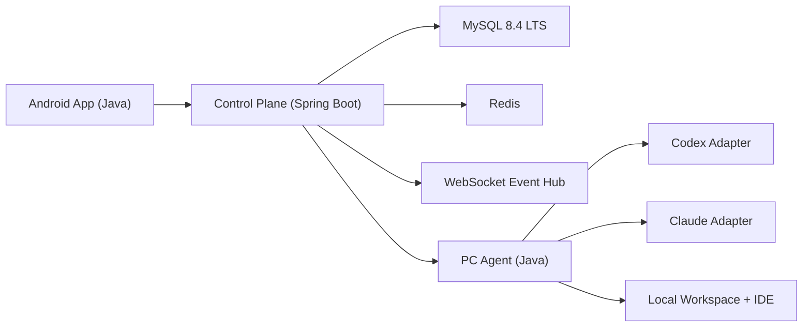
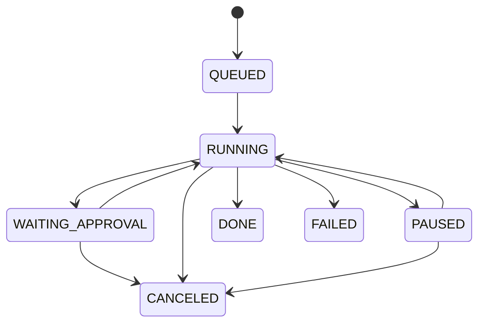

# 移动端语音操控 PC 编程助手平台（Java）完整方案（完整版）

## 0. 文档信息
- 文档版本：`v1.0`
- 生成日期：`2026-03-28`
- 目标读者：产品经理、架构师、后端/移动端/客户端工程师、运维与安全团队
- 结论：**可行，建议按“单助手 MVP -> 双助手统一编排 -> 插件化增强”分阶段落地**

---

## 1. 背景与目标

你要做的是一个“移动端远程编程控制台”：
1. 用户在手机端通过自然语音描述编程任务。
2. 平台把任务路由到 PC 端的 Codex 或 Claude Code 执行。
3. 用户在手机端实时看到进度、日志、Diff、审批请求，并可继续语音交互。

核心价值：
1. 提高开发者在非桌面场景下的生产力。
2. 把“AI 编程助手”从本地 IDE 扩展为“可远程操控的执行系统”。
3. 建立统一的多助手编排层，避免绑定单一厂商协议。

---

## 2. 项目范围

## 2.1 In Scope（首版+增强）
1. Android（Java）语音输入、任务创建、实时进度查看。
2. 云端 Java 控制平面（鉴权、任务状态机、事件流、审批流、审计）。
3. PC Java Agent（拉起助手、协议适配、工作区执行、事件回传）。
4. Codex 与 Claude Code 的统一事件抽象。
5. Diff 可视化、审批确认、取消/重试。
6. 基础可观测性与安全策略。

## 2.2 Out of Scope（后续）
1. iOS 原生端。
2. 多人协同编辑与复杂权限矩阵。
3. 全自动无审批高风险执行。
4. 企业级 SSO 的全套流程（首版可先 JWT + 设备绑定）。

---

## 3. 需求分解

## 3.1 功能需求（FR）
1. 语音输入：支持普通话语音转文本，支持手动编辑识别结果。
2. 任务创建：可选择助手类型（Codex/Claude）、项目目录、执行策略。
3. 实时反馈：展示执行日志、工具调用、文件变更、耗时。
4. 审批机制：命令执行、文件写入、Git 操作可触发审批。
5. 任务控制：暂停、继续、取消、重试。
6. 结果产物：保存日志、补丁、变更摘要。
7. 历史记录：可回看会话与审计轨迹。
8. 设备管理：PC Agent 在线状态、心跳、版本信息。

## 3.2 非功能需求（NFR）
1. 实时性：事件端到端延迟 P95 小于 `800ms`。
2. 可用性：控制平面月可用性目标 `99.9%`。
3. 安全性：TLS、短期 token、审批审计、目录白名单。
4. 一致性：任务状态转换可追踪、可恢复、幂等。
5. 可扩展：支持新增第三方助手适配器。
6. 可运维：具备指标、日志、追踪、告警闭环。

---

## 4. 可行性结论（技术层）

可行性来自三点：
1. 助手侧已有可编程接口能力（Codex app-server、Claude CLI/Remote Control）。
2. Android 原生语音输入能力成熟（SpeechRecognizer/RecognizerIntent）。
3. Java 技术栈在实时通信、鉴权、状态机、运维方面生态成熟。

---

## 5. 技术选型（Java 优先）

## 5.1 移动端
- 语言：`Java`
- 网络：`OkHttp WebSocket`
- 语音：`SpeechRecognizer` + `RecognizerIntent`
- 本地存储：`Room`
- 架构：`MVVM`（Java 实现）
- Diff 展示：文本分块 + 行级高亮

## 5.2 云端控制平面
- `Java 21 (LTS)`
- `Spring Boot 3.x`
- `Spring Web` + `Spring WebSocket(STOMP)`
- `Spring Security` + JWT
- `MySQL 8.4 LTS`（任务、审计、配置）
- `Redis`（事件缓冲、在线状态、游标恢复）
- `Actuator` + `Micrometer` + `Prometheus/Grafana`

## 5.3 PC Agent
- `Java 21`
- `ProcessBuilder` 管理 Codex/Claude 子进程
- 本地工作区管理 + 风险策略执行
- 统一事件编码后上报控制平面

---

## 6. 总体架构



---

## 7. 逻辑分层设计

## 7.1 Android 层
1. `voice`：语音采集与识别。
2. `task`：任务创建、取消、重试。
3. `stream`：实时事件订阅与断线重连。
4. `ui`：时间线、日志、Diff、审批卡片。
5. `security`：token 存储、设备绑定信息。

## 7.2 控制平面层
1. `auth-service`：登录、token、设备信任。
2. `task-service`：状态机、路由、重试策略。
3. `event-service`：事件持久化与广播。
4. `agent-service`：PC 节点注册、心跳、负载选择。
5. `approval-service`：审批请求生命周期。
6. `audit-service`：安全审计与报表。

## 7.3 PC Agent 层
1. `runtime`：进程生命周期与资源限制。
2. `adapter`：助手协议差异屏蔽。
3. `policy`：白名单与审批执行策略。
4. `workspace`：目录检查、变更汇总。
5. `publisher`：事件上报与断线重发。

---

## 8. 统一事件模型（核心）

```json
{
  "eventId": "evt_01JXYZ",
  "taskId": "tsk_01JABC",
  "sessionId": "ses_01JKLM",
  "assistant": "codex",
  "type": "approval_required",
  "level": "warn",
  "timestamp": "2026-03-28T09:15:00Z",
  "payload": {
    "action": "run_command",
    "command": "git push origin main",
    "cwd": "/workspace/project-a",
    "riskScore": 0.92,
    "reason": "network_and_remote_write"
  }
}
```

事件类型建议：
1. `task_created`
2. `task_started`
3. `assistant_output`
4. `tool_start`
5. `tool_end`
6. `file_patch_preview`
7. `approval_required`
8. `approval_decided`
9. `task_done`
10. `task_failed`
11. `heartbeat`

---

## 9. 任务状态机



状态说明：
1. `QUEUED`：任务已创建待接单。
2. `RUNNING`：助手执行中。
3. `WAITING_APPROVAL`：等待用户授权。
4. `PAUSED`：用户暂停或系统保护暂停。
5. `DONE`：成功完成。
6. `FAILED`：执行异常终止。
7. `CANCELED`：主动取消终止。

---

## 10. API 设计（MVP + 可扩展）

## 10.1 REST API
1. `POST /api/v1/tasks`：创建任务
2. `GET /api/v1/tasks/{taskId}`：任务详情
3. `POST /api/v1/tasks/{taskId}/cancel`：取消
4. `POST /api/v1/tasks/{taskId}/retry`：重试
5. `POST /api/v1/tasks/{taskId}/approval`：审批
6. `GET /api/v1/tasks/{taskId}/events`：历史事件分页
7. `GET /api/v1/tasks/{taskId}/artifacts`：日志与补丁

## 10.2 WebSocket
1. 连接：`/ws`
2. Topic：`/topic/tasks/{taskId}`
3. 消息：统一 `TaskEvent` JSON
4. 恢复：携带 `lastEventId` 实现断线续流

---

## 11. 数据库设计（核心表）

1. `users`：用户主数据
2. `devices`：移动设备信息、绑定状态
3. `agents`：PC 节点、在线状态、能力标签
4. `projects`：仓库路径、白名单配置
5. `tasks`：任务主表（状态、助手类型、耗时）
6. `task_events`：事件明细（可分页）
7. `approvals`：审批记录（请求、决策、操作人）
8. `artifacts`：日志、补丁、报告链接
9. `audit_logs`：安全审计全量记录

---

## 12. 安全设计（必须落地）

## 12.1 认证与授权
1. JWT Access Token + Refresh Token。
2. 设备绑定与可撤销机制。
3. RBAC 最小权限模型。

## 12.2 执行安全
1. 工作目录白名单。
2. 命令白名单与风险分级。
3. 高风险动作默认审批。
4. PC Agent 以普通用户权限运行。

## 12.3 传输与存储安全
1. 全链路 TLS。
2. 关键字段加密存储。
3. 审计日志防篡改策略（签名或不可变存储）。

---

## 13. 审批策略设计

风险分级建议：
1. `LOW`：读取日志、代码检索，可自动通过。
2. `MEDIUM`：本地文件写入，需要可配置审批。
3. `HIGH`：执行 shell 命令、Git push、网络写操作，强制审批。

审批消息示例：

```json
{
  "approvalId": "apr_1001",
  "taskId": "tsk_01JABC",
  "riskLevel": "HIGH",
  "action": "run_command",
  "command": "git push origin main",
  "expiresAt": "2026-03-28T09:20:00Z"
}
```

---

## 14. 可观测性与运维

核心指标：
1. `task_create_latency_ms`
2. `event_end_to_end_latency_ms`
3. `task_success_rate`
4. `approval_wait_time_ms`
5. `agent_online_count`
6. `ws_connection_active`
7. `task_state_transition_error_count`

告警规则：
1. 5 分钟内失败率超过阈值。
2. Agent 心跳丢失超过 30 秒。
3. 事件延迟连续 10 分钟高于 SLO。
4. 审批积压数量异常增长。

---

## 15. CI/CD 与交付流程

1. Monorepo 或多仓库均可，推荐多仓库分治。
2. 后端与 Agent 使用 Maven/Gradle 构建。
3. CI 执行单元测试、集成测试、静态扫描。
4. Docker 镜像化部署控制平面。
5. 生产灰度：按组织或项目维度分批启用。
6. 回滚策略：版本化部署 + 数据兼容迁移脚本。

---

## 16. 测试策略

## 16.1 后端测试
1. 单元测试：状态机、鉴权、审批逻辑。
2. 集成测试：WebSocket 推送、事件落库、重连恢复。
3. 合约测试：REST 与事件 schema。

## 16.2 Agent 测试
1. 适配器协议解析测试。
2. 进程崩溃恢复测试。
3. 白名单与高风险动作拦截测试。

## 16.3 移动端测试
1. 语音识别失败/噪声/中断场景。
2. 弱网断连重连。
3. 长会话 UI 性能测试。

## 16.4 端到端测试
1. 语音下发任务到完成的全链路。
2. 审批阻断与继续执行。
3. 任务取消后资源清理与状态一致性。

---

## 17. 分阶段里程碑（12 周）

| 周期 | 目标 | 交付 |
|---|---|---|
| 第1-2周 | 架构与骨架 | 控制平面骨架、Android 壳、Agent 心跳 |
| 第3-4周 | Codex MVP | 任务创建、日志流、状态机 |
| 第5-6周 | 安全与审批 | 白名单、审批流程、审计落库 |
| 第7-8周 | Claude 接入 | 第二适配器、统一事件模型完善 |
| 第9-10周 | 可视化增强 | Diff 视图、历史回放、断线恢复 |
| 第11周 | 稳定性优化 | 压测、告警、故障演练 |
| 第12周 | 灰度上线 | 试点用户、回收反馈、版本迭代 |

---

## 18. 团队与人力建议（最小可行）

1. 后端工程师 `2` 人（控制平面 + 数据模型 + 安全）。
2. Java 客户端工程师 `1` 人（PC Agent）。
3. Android 工程师 `1` 人（Java）。
4. 测试工程师 `1` 人（自动化+端到端）。
5. 兼任 DevOps `0.5` 人力。

---

## 19. 风险与缓解

1. 协议变化风险：助手接口更新导致适配器失效。  
缓解：适配层隔离、契约测试、版本探测与降级。

2. 安全风险：远程命令执行边界失控。  
缓解：目录/命令双白名单、强制审批、最小权限运行。

3. 稳定性风险：长连接中断导致状态错乱。  
缓解：事件持久化、游标恢复、状态机幂等。

4. 体验风险：语音识别准确率波动。  
缓解：识别结果可编辑、上下文纠错、重录机制。

5. 成本风险：日志与事件存储增长快。  
缓解：冷热分层、归档策略、可配置保留期。

---

## 20. MVP 验收标准（可执行）

1. Android 端可通过语音创建任务并展示文本确认。
2. 控制平面可把任务路由到指定 PC Agent。
3. Codex 路径可稳定执行并实时回传日志事件。
4. 至少 1 类高风险动作触发审批并可继续执行。
5. 任务可取消，状态一致且资源释放成功。
6. 审计表可查询每次关键动作与操作人。
7. 端到端成功率在试点环境达到约定阈值。

---

## 21. Java 接口骨架（示例）

```java
public interface AssistantAdapter {
    String adapterName();
    void startSession(SessionContext context);
    void sendPrompt(String sessionId, String prompt);
    void approve(String sessionId, ApprovalDecision decision);
    void cancel(String sessionId);
    void close(String sessionId);
}
```

```java
public class TaskEvent {
    public String eventId;
    public String taskId;
    public String sessionId;
    public String assistant;
    public String type;
    public String level;
    public String payloadJson;
    public long timestampMs;
}
```

```java
public interface EventPublisher {
    void publish(TaskEvent event);
}
```

---

## 22. 建议仓库结构

```text
mobile-android-java/
pc-agent-java/
control-plane-spring/
infra/
docs/
```

---

## 23. 后续增强路线

1. 增加 IDE 插件（VS Code / JetBrains）展示会话与审批。
2. 多项目并发调度与优先级队列。
3. 团队协同能力（共享任务流、角色审批）。
4. 更细粒度策略引擎（按仓库、分支、命令类型控制）。
5. 引入多模态输入（截图+语音）辅助任务描述。

---

## 24. 参考资料（官方）
1. OpenAI Codex 仓库：<https://github.com/openai/codex>  
2. Codex App Server：<https://developers.openai.com/codex/app-server>  
3. Claude Code Remote Control：<https://code.claude.com/docs/en/remote-control>  
4. Claude Code CLI Reference：<https://code.claude.com/docs/en/cli-reference>  
5. Android RecognizerIntent：<https://developer.android.com/reference/android/speech/RecognizerIntent>  
6. Spring WebSocket STOMP：<https://docs.spring.io/spring-framework/reference/web/websocket/stomp/enable.html>  
7. Spring Security WebSocket：<https://docs.spring.io/spring-security/reference/servlet/integrations/websocket.html>  
8. Spring Boot Actuator：<https://docs.spring.io/spring-boot/reference/actuator/>

---

## 25. 一句话落地建议
先用 `Java 21 + Spring Boot + Android(Java) + PC Agent(Java)` 做 **Codex 单助手闭环 MVP**，把“语音 -> 执行 -> 可视化 -> 审批 -> 审计”跑通，再扩展 Claude 和 IDE 插件层，成功率最高、迭代风险最低。
