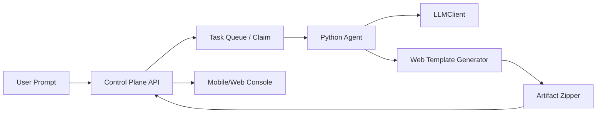

# 自然语言生成 Web（基础版）PR 执行手册

日期：2026-04-09  
适用范围：`shared-protocol`、`control-plane-spring`、`python-agent`  
目标：实现“用户输入自然语言 -> 系统生成可运行 Web 工程 -> 产物 zip 下载”的最小闭环。

---

## 1. 交付目标（MVP）

本轮只做基础能力，不追求多模板和复杂编排：

1. 用户提交自然语言需求（仅 `target=web`）。
2. Python Agent 生成单模板 Web 工程（HTML/CSS/JS + README）。
3. 生成产物 `export.zip` 并上传/登记到控制面。
4. 控制面可查询任务事件和产物下载链接。
5. 全链路失败可观测（`TASK_FAILED` + reason）。

---

## 2. 技术架构（最小可运行）



架构原则：

1. 契约先行：事件与产物字段以 `shared-protocol` 为准。
2. 控制面只做编排与存储，不复制生成逻辑。
3. Python Agent 负责“生成 + 打包 + 上报”，不直连数据库。
4. 默认可降级：LLM 失败时允许模板兜底，保证任务可完成。

---

## 3. 三个 Agent 的 PR 任务拆分

## Agent-2（契约层）

PR 标题建议：`feat(shared-protocol): add nl2web generation and artifact event contracts`

分支建议：`feat/a2-nl2web-contracts`

改动范围：

- `shared-protocol/src/main/**`
- `shared-protocol/src/test/**`

必须交付：

1. 为任务输入补齐字段（如 `target`, `templateId`, `exportMode`）。
2. 定义/补齐事件 payload：
   - `SPEC_PROPOSED`
   - `FILE_PATCH_PREVIEW`
   - `ARTIFACT_READY`
   - `TASK_FAILED`（含标准 reason）
3. 为产物补齐元数据：
   - `artifactId`, `fileName`, `sha256`, `size`, `mimeType`
4. 增加序列化与兼容性测试（新字段可选、旧 payload 不破）。

验收命令：

```bash
mvn -B -q -pl shared-protocol test
```

---

## Agent-1（控制面）

PR 标题建议：`feat(control-plane): support nl2web artifact lifecycle`

分支建议：`feat/a1-nl2web-artifact-lifecycle`

改动范围：

- `control-plane-spring/src/main/**`
- `control-plane-spring/src/test/**`

必须交付：

1. 接收并落库新增事件字段（含产物元数据）。
2. 打通产物生命周期接口：
   - 任务维度产物列表
   - 产物下载（含鉴权）
3. `TASK_FAILED` reason 透传到查询接口，便于前端展示失败原因。
4. 增加集成测试：事件摄取 -> 产物可查 -> 下载鉴权正确。

验收命令：

```bash
mvn -B -q -pl shared-protocol,control-plane-spring -am test
```

---

## Agent-3（Python Agent，主执行链路）

PR 标题建议：`feat(python-agent): generate single-template web and publish artifact zip`

分支建议：`feat/a3-nl2web-single-template-artifact`

改动范围：

- `python-agent/**`

必须交付：

1. Prompt -> Intent/Plan 最小闭环：
   - 仅支持 `target=web` 的主路径
   - 非 web 请求返回可解释失败 reason
2. 单模板工程生成：
   - 输出 `index.html`, `styles.css`, `app.js`, `README.generated.md`
3. Artifact 打包：
   - 生成 `export.zip`
   - 计算 `sha256` 与 `size`
4. 事件上报：
   - 生成成功上报 `ARTIFACT_READY`
   - 失败上报 `TASK_FAILED(reason=...)`
5. 单测覆盖：
   - 模板生成成功
   - zip 结构校验
   - 事件字段完整性
   - LLM 失败时模板兜底路径

验收命令：

```bash
cd python-agent && pytest -q
```

---

## 4. 依赖与合并顺序

1. Agent-2 先合并（契约稳定）。
2. Agent-1 与 Agent-3 并行开发。
3. Agent-1 / Agent-3 合并后做一次端到端联调。

统一回归门禁：

```bash
mvn -B -q -pl shared-protocol,control-plane-spring -am test
cd python-agent && pytest -q
```

---

## 5. 风险清单（明确）

1. 契约漂移风险  
现象：Agent-1/3 事件字段命名不一致，导致控制面解析失败。  
控制：先合并 Agent-2；新增事件 JSON 样例作为回归基线。

2. LLM 不稳定风险  
现象：模型超时或返回非结构化内容。  
控制：Agent-3 提供模板兜底；失败统一 reason 编码。

3. 产物不可复现风险  
现象：zip 内容缺文件或 hash 不稳定。  
控制：固定打包顺序；单测校验 zip 文件列表与 hash 算法。

4. 下载安全风险  
现象：未授权用户可下载任务产物。  
控制：Agent-1 下载接口鉴权必测；审计日志记录 actor/taskId/artifactId。

5. 任务状态不一致风险  
现象：Python 侧成功但控制面未持久化，用户看到卡住。  
控制：事件上报失败重试 + 幂等键；失败时明确 `TASK_FAILED`。

---

## 6. 技术决策边界

本轮不做：

1. 多模板市场与模板推荐。
2. 小程序（`miniapp`）目标生成。
3. 在线预览与一键部署。
4. 复杂多轮自动修复链路（Fix Loop 增强版放后续 PR）。

---

## 7. 给 Agent 的执行模板（可直接复用）

请按以下顺序执行：

1. 从 `origin/master` 新建分支。
2. 仅修改白名单路径内文件。
3. 本地跑对应验收命令通过后再提交。
4. 提交信息格式：`type(scope): summary`。
5. PR 描述必须包含：
   - 变更点
   - 风险与回滚
   - 验收命令与结果
   - 影响范围

提交示例：

```text
feat(python-agent): generate web template project and publish artifact zip
```

---

## 8. 完成定义（DoD）

1. 用户输入自然语言后，任务可进入执行并产出 `export.zip`。
2. 控制面可查询并下载产物，鉴权正确。
3. 失败时有标准 reason，前端可展示。
4. 三个模块测试全部通过，且主分支可回归。
