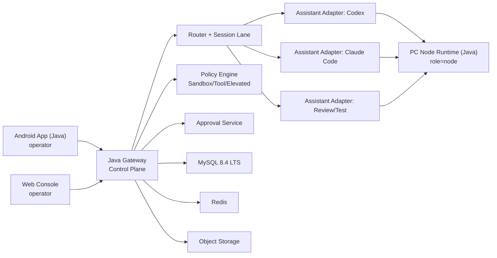
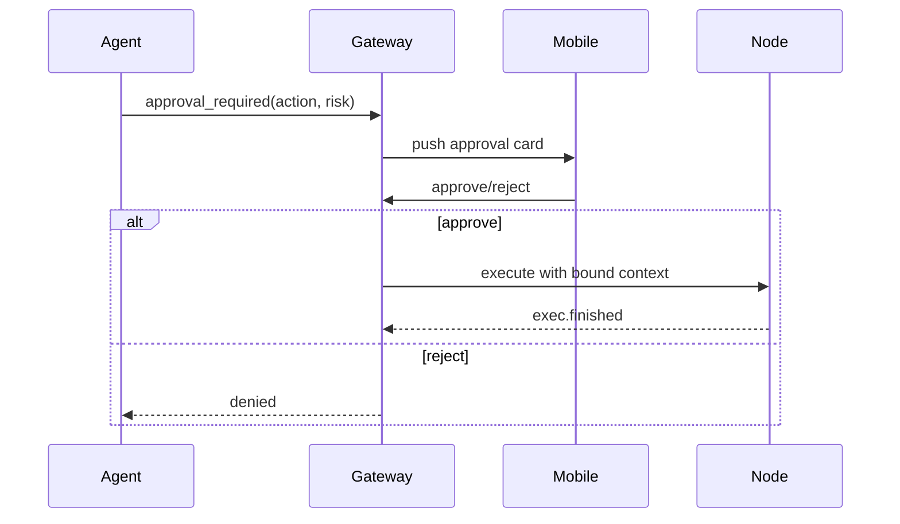

# 基于 OpenClaw 思路的移动端语音控 PC 编程助手架构（Java 版）

## 文档信息
- 版本: `v1.0`
- 日期: `2026-03-28`
- 目标: 在你现有方案基础上，融合 OpenClaw 的 Gateway / 多 Agent / 安全治理模式，形成可落地的 Java 架构蓝图。

---

## 1. 执行摘要

你的产品方向是可行的，且可以明显受益于 OpenClaw 的四个核心思想：
1. `Gateway-first`：所有客户端与节点通过统一 WS 控制平面接入。
2. `Operator / Node` 角色分离：移动端管“意图和审批”，PC 端管“能力执行”。
3. `多 Agent 路由`：按任务类型、风险、项目路由到不同能力代理。
4. `安全三层控制`：Sandbox（在哪跑）+ Tool Policy（能调什么）+ Elevated（是否允许提权执行）。

建议采用 `Java-first + OpenClaw-compatible` 路线：
- 核心服务和控制面都用 Java 实现。
- 协议、会话、路由、安全模型向 OpenClaw 对齐，保证后续可兼容 ACP / 节点生态。

---

## 2. OpenClaw 给你的关键启发（可直接复用）

## 2.1 Gateway 单一控制平面
OpenClaw 把所有入口统一到一个长期运行的 Gateway（WS + HTTP 同端口），客户端首帧必须 `connect`，后续统一 `req/res/event`。

对你的价值：
1. 手机端、Web 管理台、PC Agent、自动化脚本可以共用一套协议。
2. 实时事件流、任务状态、审批流统一建模，不会形成多套 API。
3. 便于断线重连与状态恢复。

## 2.2 角色化接入（operator / node）
OpenClaw 强调角色声明与能力声明：
1. `operator`: 控制面读写、审批、管理。
2. `node`: 上报本机可执行能力（如 camera/canvas/system.run）。

对你的价值：
1. 移动端和 PC 端职责清晰。
2. 权限模型天然最小化。
3. 支持一台手机控制多台 PC 节点。

## 2.3 两阶段执行确认
OpenClaw 的 `agent` 运行是“两阶段”：先 `accepted`，再流式事件，最后 `ok/error`。

对你的价值：
1. 任务创建和任务完成语义分离，避免“接口超时但任务已跑”。
2. 非常适合移动端弱网场景。

## 2.4 幂等键与重试安全
OpenClaw 对副作用方法强调 `idempotencyKey`。

对你的价值：
1. 手机端重试不会触发重复执行（尤其是写文件、执行命令）。
2. 可在 Redis 中做短时去重缓存。

## 2.5 多 Agent + 每 Agent 隔离
OpenClaw 多 Agent 机制强调“独立 workspace / agentDir / session / tools/sandbox”。

对你的价值：
1. `coder`、`reviewer`、`tester` 能并行并隔离。
2. 受信 Agent 可写代码，不受信 Agent 只读分析。
3. 跨项目隔离天然清晰。

## 2.6 安全三层模型
OpenClaw 的实践可概括为：
1. Sandbox 决定“在哪里执行”。
2. Tool policy 决定“允许哪些工具”。
3. Elevated 是受限的 exec 提权通道，不等同于放开所有权限。

对你的价值：
1. 安全策略不再只靠“人工审批”。
2. 可把风险收敛为可配置策略。

---

## 3. 目标架构（融合版）



核心分层：
1. `Control Plane`：协议、鉴权、任务状态机、审计。
2. `Router`：选择 Agent/Profile/Node。
3. `Runtime Adapter`：对接 Codex / Claude / 未来 ACP harness。
4. `Policy`：工具权限、命令审批、执行边界。
5. `Event Fabric`：统一实时事件流和历史回放。

---

## 4. 两种实现路线（都支持 Java）

## 4.1 路线 A：OpenClaw 作为“执行与路由内核”
模式：
- Java 控制平面负责业务（用户、项目、计费、审计、移动端 API）。
- OpenClaw Gateway 作为 agent runtime + routing 核心。
- Java 通过 WS/HTTP 协议调用 OpenClaw（或 ACP 机制）。

优点：
1. 上线快，复用成熟 routing 与节点机制。
2. 多助手接入阻力小（ACP 已覆盖多类 harness）。

缺点：
1. 栈混合（Java + Node 运行时）。
2. 深度定制成本受上游版本影响。

## 4.2 路线 B：Java 自研 Gateway（推荐长期）
模式：
- 用 Spring Boot + WS 完整复刻 Gateway 模型。
- 协议兼容 OpenClaw 关键语义（connect/challenge/req-res-event/idempotency/run lifecycle）。
- Adapter 层对接 Codex、Claude。

优点：
1. 技术栈统一，运维一致。
2. 企业化改造（审计、合规、私有化）更可控。

缺点：
1. 初期实现成本更高。
2. 需要自行维护协议演进与兼容测试。

## 4.3 推荐策略
1. `MVP` 用路线 A（最快验证产品价值）。
2. `Scale` 阶段迁移到路线 B（保持协议兼容，平滑替换 runtime）。

---

## 5. Java Gateway 协议设计（OpenClaw 风格）

## 5.1 传输层
1. WebSocket 文本帧 + JSON。
2. 第一帧必须 `connect`。
3. 三种帧：`req` / `res` / `event`。

## 5.2 握手
服务端先发 challenge：

```json
{
  "type": "event",
  "event": "connect.challenge",
  "payload": { "nonce": "abc123", "ts": 1774650000000 }
}
```

客户端响应 connect：

```json
{
  "type": "req",
  "id": "r-1",
  "method": "connect",
  "params": {
    "minProtocol": 1,
    "maxProtocol": 1,
    "role": "operator",
    "client": {
      "id": "android-app",
      "version": "1.0.0",
      "platform": "android",
      "mode": "operator"
    },
    "auth": { "token": "jwt-or-device-token" },
    "device": {
      "id": "device_fingerprint",
      "signature": "signed_nonce"
    }
  }
}
```

## 5.3 通用帧

```json
{ "type": "req", "id": "x", "method": "task.create", "params": {} }
```

```json
{ "type": "res", "id": "x", "ok": true, "payload": {} }
```

```json
{ "type": "event", "event": "task.update", "payload": {}, "seq": 1001 }
```

## 5.4 两阶段任务执行
1. `task.run` 返回 `{status:"accepted", runId}`。
2. 执行中持续推送 `event:task.stream`。
3. 完成后返回最终状态 `{status:"ok"|"error"}`。

## 5.5 幂等要求
对副作用方法强制 `idempotencyKey`：
1. `task.create`
2. `task.run`
3. `task.approve`
4. `node.invoke`

---

## 6. 会话与路由（Session Lane）

## 6.1 Session Key 设计
建议：`{tenant}:{project}:{agentProfile}:{conversationId}`。

示例：
- `acme:repoA:coder:user-1001`
- `acme:repoA:reviewer:task-7788`

## 6.2 串行车道（Lane）
1. 同一 `sessionKey` 串行执行，防止并发写冲突。
2. 跨 session 并发，按 node 资源限流。

## 6.3 插话策略
参考 OpenClaw 的队列模式思想：
1. `steer`: 当前轮次在下一个模型边界注入补充指令。
2. `followup`: 当前轮结束后作为新轮次处理。

这对“手机语音中途补充需求”非常关键。

---

## 7. 多 Agent 设计（结合你的场景）

推荐 Agent Profile：
1. `coder`：改代码、生成 patch。
2. `reviewer`：静态审查、风险评估。
3. `tester`：执行测试、输出失败归因。
4. `release-guard`：发布前检查（分支、版本、变更规模）。

路由规则建议：
1. Bug 修复默认 `coder -> tester`。
2. 高风险变更增加 `reviewer`。
3. 涉及发布指令必须经过 `release-guard`。

---

## 8. 安全架构（重点）

## 8.1 三层控制模型
1. `Execution Boundary`（Sandbox）
- host / container / remote-node

2. `Tool Policy`
- allow/deny/group-based
- deny 优先

3. `Elevated Exec`
- 仅 exec 可提权
- 不绕过 tool deny
- 必须审批

## 8.2 风险分级
1. `LOW`：只读检索、日志查询
2. `MEDIUM`：写本地文件、运行测试
3. `HIGH`：shell 命令、git push、外网访问

## 8.3 审批流



关键控制：
1. 审批绑定 `cwd + argv + 目标文件摘要`，防止审批后漂移执行。
2. 审批超时默认拒绝。
3. UI 不在线时 fallback 策略默认 deny。

---

## 9. 与 Codex / Claude 的适配层设计

## 9.1 统一接口

```java
public interface AssistantAdapter {
    String name();
    RunAccepted start(TaskSpec spec);
    void steer(String runId, String message);
    void approve(String runId, ApprovalDecision decision);
    void cancel(String runId);
}
```

## 9.2 事件标准化
统一事件：
1. `assistant.output`
2. `tool.start`
3. `tool.end`
4. `file.patch`
5. `approval.required`
6. `run.done`
7. `run.error`

## 9.3 ACP 兼容位
保留 `runtime=acp` 选项，让系统可无缝接入外部 harness（含 Codex、Claude Code 生态）。

---

## 10. Android（Java）端体验设计

## 10.1 语音输入
1. 手动按住说话（首版默认）。
2. 支持识别结果编辑后再发送。
3. 失败自动回退到文本输入。

## 10.2 实时可视化
1. 时间线：阶段节点（accepted / running / approval / done）。
2. 日志流：按事件类型过滤。
3. Diff 预览：文件列表 + 行数变化。
4. 审批卡片：风险等级、命令详情、影响范围。

## 10.3 弱网策略
1. WS 断线指数退避重连。
2. 带 `lastSeq` 重新订阅。
3. 断线期间关键事件本地缓存（Room）。

---

## 11. 数据模型（后端）

核心表：
1. `users`
2. `devices`
3. `nodes`
4. `projects`
5. `agent_profiles`
6. `tasks`
7. `task_runs`
8. `task_events`
9. `approvals`
10. `audit_logs`

关键索引：
1. `task_events(task_id, seq)`
2. `task_runs(session_key, created_at desc)`
3. `approvals(status, expires_at)`

---

## 12. 可观测性与运维

SLO 建议：
1. 任务受理延迟 P95 < 300ms
2. 事件推送延迟 P95 < 800ms
3. 任务成功率 > 95%（MVP）

指标：
1. `gateway_ws_active_connections`
2. `task_run_accepted_total`
3. `task_run_failed_total`
4. `approval_pending_total`
5. `node_heartbeat_gap_seconds`

告警：
1. 5 分钟失败率超过阈值
2. 节点心跳缺失 > 30s
3. 审批积压异常

---

## 13. 部署拓扑

## 13.1 单机开发
1. Spring Boot + MySQL + Redis（Docker Compose）
2. 本机 PC Node
3. Android 真机连接内网

## 13.2 团队部署
1. 控制平面上 K8s
2. Node 分布在开发者机器或构建机
3. mTLS + 设备配对
4. 审计日志归档到对象存储

---

## 14. 12 周落地计划

1. 周 1-2：协议与状态机
- 完成 `connect/req/res/event` 与两阶段 run

2. 周 3-4：Codex 适配
- 跑通创建任务、流式事件、完成回传

3. 周 5-6：审批与安全
- 上线风险分级、审批、执行绑定

4. 周 7-8：Claude 适配
- 统一事件模型，补齐 steer/cancel

5. 周 9-10：多 Agent 路由
- coder/reviewer/tester 流程编排

6. 周 11-12：稳定性与灰度
- 压测、告警、小范围上线

---

## 15. 你可以直接用的配置草案（示意）

```json
{
  "gateway": {
    "port": 18789,
    "auth": { "mode": "token" },
    "security": {
      "allowedOrigins": ["https://app.example.com"],
      "requireDevicePairing": true
    }
  },
  "routing": {
    "defaultProfile": "coder",
    "rules": [
      { "when": { "taskType": "bugfix" }, "then": ["coder", "tester"] },
      { "when": { "risk": "high" }, "then": ["reviewer"] }
    ]
  },
  "policy": {
    "tools": {
      "coder": { "allow": ["read", "edit", "write", "exec"], "deny": [] },
      "reviewer": { "allow": ["read"], "deny": ["exec", "write", "edit"] }
    },
    "exec": {
      "approvalRequired": true,
      "askFallback": "deny"
    }
  }
}
```

---

## 16. 风险与对应策略

1. 协议漂移风险
- 策略：契约测试 + schema 版本号 + 向后兼容窗口

2. 多助手输出不一致
- 策略：事件标准化层 + 适配器回归测试集

3. 提权执行风险
- 策略：高风险默认拒绝、审批绑定上下文、审计追踪

4. 弱网导致状态错乱
- 策略：事件 `seq` + lastSeq 恢复 + 状态重算 API

---

## 17. 最终建议

如果你要“快上线 + 长期可控”两者兼得：
1. 先做 Java 控制平面，协议按 OpenClaw 模型设计。
2. MVP 阶段允许接入 OpenClaw/ACP 作为外部 runtime。
3. 逐步把 runtime 能力迁移到 Java Node + Adapter，实现完整自控。

这样你可以在 3 个月内看到产品价值，同时保留未来技术主导权。

---

## 18. 参考资料（官方）
1. OpenClaw 首页与能力概览: https://docs.openclaw.ai/
2. Gateway Architecture: https://docs.openclaw.ai/concepts/architecture
3. Gateway Protocol: https://docs.openclaw.ai/gateway/protocol
4. Gateway Runbook: https://docs.openclaw.ai/gateway/index
5. Multi-Agent Routing: https://docs.openclaw.ai/concepts/multi-agent
6. Multi-Agent Sandbox & Tools: https://docs.openclaw.ai/tools/multi-agent-sandbox-tools
7. Sandbox vs Tool Policy vs Elevated: https://docs.openclaw.ai/gateway/sandbox-vs-tool-policy-vs-elevated
8. Sandboxing: https://docs.openclaw.ai/sandboxing
9. Exec Approvals: https://docs.openclaw.ai/tools/exec-approvals
10. ACP Agents: https://docs.openclaw.ai/tools/acp-agents
11. Trusted Proxy Auth: https://docs.openclaw.ai/gateway/trusted-proxy-auth
12. Nodes 概念: https://docs.openclaw.ai/zh-CN/nodes

